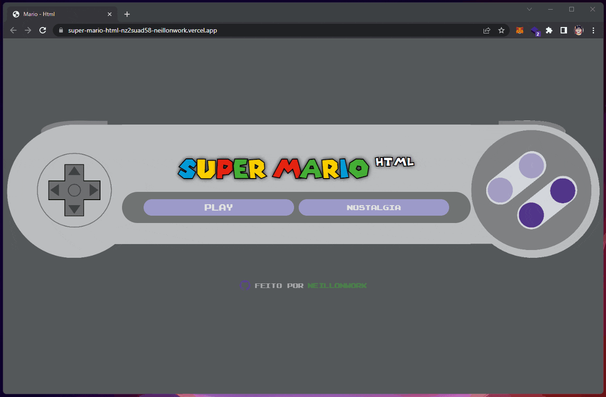
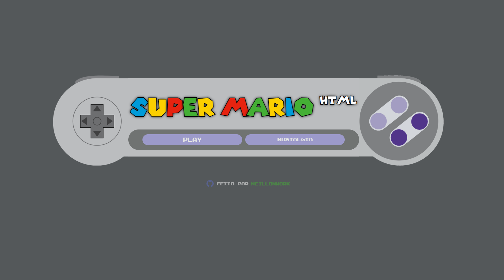
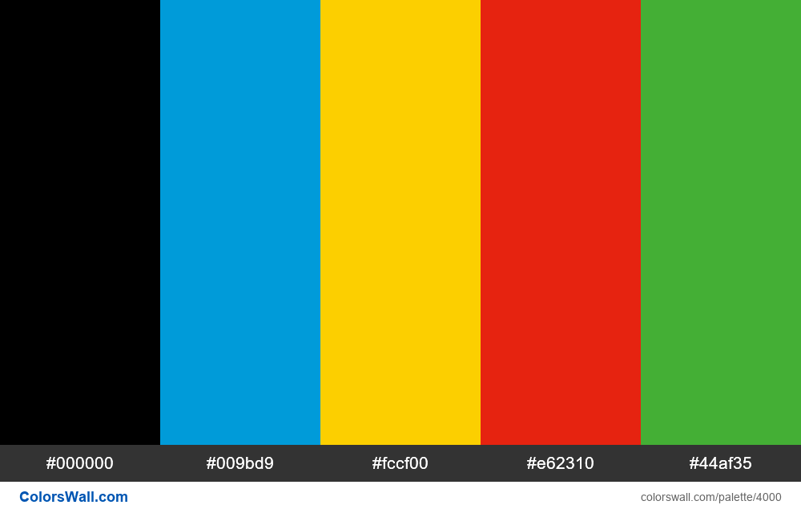
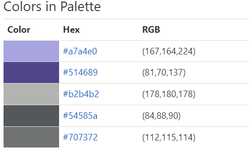

# App: Super-Mario-HTML

Arvore de link para utilizar em redes sociais

<a href="#imagens">Imagens </a> -
<a href="#sobre">Sobre </a> -
<a href="#features">Features </a> -
<a href="#tecnologias">Tecnologias </a> -
<a href="#executar">Como executar o projeto</a> -
<a href="#autor">Autor </a>

# Imagens

- Responsividade desktop e mobile utilizando "flex". 
- Cores utilizadas/baseadas de acordo com a paleta disponibilizada na documentação.

<table>
 <tr>
 Tela inicial _ responsividade
 </tr>
   <tr>
     <td valign="top"></td>
  </tr>
  <tr>
    <td>Desktop - Controle SNES</td>
    <td>Mobile - GAMEBOY</td>
    <td>Cor - titulo</td>
    <td>Estilo, referencias</td>
  </tr>

  <tr>
    <td valign="top"></td>
    <td valign="top"></td>  
    <td valign="top"></td>
    <td valign="top"></td>
  </tr>

 </table>

# Sobre

Pagina para estudo de animações em CSS e manipulação de imagens e audio via javascript.

<strong>Referencias:</strong>Inspirado atraves da video aula <a href="">Add canal referencia</a>...

# Tecnologias

<ul>
<li>HTML 5</li>
<li>CSS 3</li>
<li>JavaScript</li>
<li>Google Font API</li>
<li>FlatIcon</li>
</ul>

# Executar

<strong> | Passos para executar o projeto localmente :</strong>

<b>1</b> - Clique no botão <b>Code</b>,  
<b>2</b> - Após selecione a última opção <b>"Download ZIP"</b>, 
<b>3</b> - Descompacte o arquivo após o download. 
<b>4</b> - Localize o arquivo index.html, de duplo clique para iniciar o projeto no <b>navegador de sua preferência.</b>  

Para editar o projeto é necessario ter instalado em sua maquina um editor de codigos. 
Recomendo utilizar o <a href="https://code.visualstudio.com/download" target="_blank">VSCODE</a> por ser compativel com a maioria dos hardwares atualmente. 

# Autor

Desenvolvido por: :nerd_face: <a href="https://github.com/NeillonWork"><strong> NeillonWork</strong>

